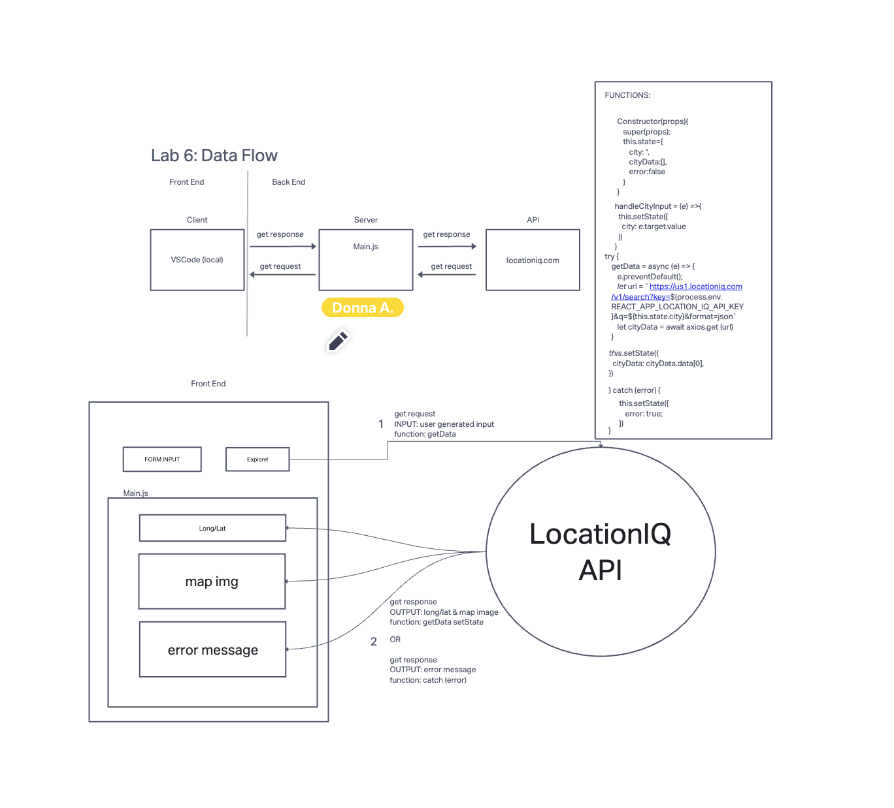

# City Explorer

**Author**: Heather Holcomb
**Version**: 1.2.1 
<!-- (increment the patch/fix version number if you make more commits past your first submission) -->

## Quick Links
* [Trello Project Board](https://trello.com/b/aBkEngzn/city-explorer-module-2)
* [Deployed App on Netlify](https://city-explorer-heatherholcomb.netlify.app/)
* [Deployed Server on Render](https://city-explorer-api-npnt.onrender.com)

***

## Overview

City Explorer solves the problem of navigating unfamiliar cities and finding must-see attractions. It provides users with real-time weather information, movies related to the destination, and restaurant information. Users can enter a location and see its latitude and longitude on a map, making exploring neighborhoods and parks easier. City Explorer makes travel more enjoyable and stress-free.

***

## Getting Started

To are the steps you need to take to build and run City Explorer on your own machine:

| Step | Description |
| --- | --- |
| 1 | Install Node.js: City Explorer is built using Node.js, so the first step is to install it on your machine. You can download and install the latest version from the [official website](https://nodejs.org/en/download/). |
| 2 | Clone the repository: The City Explorer code is hosted on a Git repository. You'll need to clone it to your local machine using a Git client such as Git Bash or GitHub Desktop. |
| 3 | Install dependencies: City Explorer relies on several third-party dependencies such as Express, Request, and EJS. You can install them using Node Package Manager (NPM) by navigating to the project's root directory and running the command `npm install`. |
| 4 | Obtain API keys: City Explorer uses several APIs such as OpenWeatherMap and The Movie Database. You'll need to obtain API keys from these services and store them securely in a `.env` file. |
| 5 | Start the server: Once you have installed all the dependencies and obtained the necessary API keys, you can start the server by running the command `npm start` in the terminal. |
| 6 | Access the app: City Explorer should now be running on your local machine. You can access it by opening a web browser and navigating to `http://localhost:3000/`. |

These steps provide a high-level overview of the process for building and running City Explorer on your own machine. However, it's important to note that there may be additional configuration steps and dependencies required depending on your specific machine and development environment.

***

## Architecture

* City Explorer is a web application designed to provide users with information about a city they're interested in exploring.
    * The back-end is built using Node.js, which handles server-side logic and communicates with third-party APIs.
        * [Geocoding API](https://locationiq.com/)
        * [Weather Bit API](https://www.weatherbit.io/)
        * [Yelp API](https://www.yelp.com/developers/documentation/v3/business_search)
        * [The Movie DB API](https://developers.themoviedb.org/3/getting-started/introduction)
    * The front-end is built using React, HTML, CSS, and JavaScript, which structure and style the content and add interactivity.
    * The .env library is used to store sensitive information securely.

### Web request-response cycle & Data Flow
* Lab 06: 

* Lab 07: 

<!-- Provide a detailed description of the application design. What technologies (languages, libraries, etc) you're using, and any other relevant design information. -->

***

## Change Log

| Date and Time (in PST) | Brief summary of the changes made |
| --- | --- |
| 04-07-2023 2:15pm | Verified creation of react-app and linked to GitHub repo |
| 04-07-2023 2:59pm | Updated README with required assignment info |
| 04-07-2023 3:21pm | Verified deployment of Netlify app |
| 04-07-2023 3:42pm | Completed set up of repo and API keys |
| 04-07-2023 3:42pm | Verified API query for city data |
| 04-18-2023 4:14pm | Deployed live server |
| [DATE AND TIME] | [BRIEF SUMMARY OF CHANGES MADE] |
| [DATE AND TIME] | [BRIEF SUMMARY OF CHANGES MADE] |

<!-- Use this area to document the iterative changes made to your application as each feature is successfully implemented. Use time stamps. Here's an example:

01-01-2001 4:59pm - Application now has a fully-functional express server, with a GET route for the location resource. -->

***

## Credit and Collaborations
<!-- Give credit (and a link) to other people or resources that helped you build this application. -->

Thanks to Donna Ada and Isabel Sopha for collaborating on WRRC for Lab 06. 

***

## Time Estimates

| Lab | Number & Name of Feature | Estimate of Time Needed to Complete | Start Time | Finish Time | Actual Time Needed to Complete |
| --- | --- | --- | --- | --- | --- |
| 06 | 1. Set Up your React repo & API keys | 30 min | 2:08p | 3:42p | 1 hr 34 min |
| 06 | 2. Locations | 1 hour | 3:42p | 5:22p | 1 hr 40m |
| 06 | 3. Map | 45 min | 5:22p | 9:37p | 1 hr 30m* |
| 06 | 4. Errors | 45 min | 9:37p | 9:53p | 1 hr 40m** |

